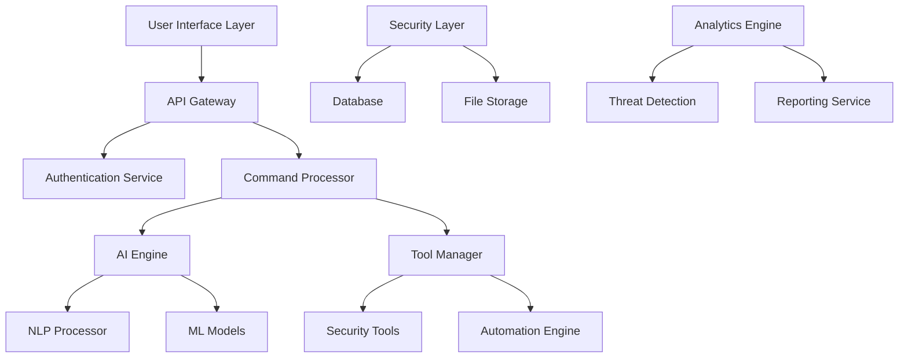

<div align="center">

# LEWIS
## Linux Environment Working Intelligence System


[](https://github.com/yashab-cyber/lewis)
[](LICENSE)
[](https://python.org)
[](https://www.linux.org/)

[](DONATE.md)
[](https://www.zehrasec.com)

**Next-Generation AI-Powered Cybersecurity Intelligence Platform**

</div>

---

## 🚀 Overview

**LEWIS** (Linux Environment Working Intelligence System) is an enterprise-grade, AI-powered cybersecurity platform designed for professional security analysts, ethical hackers, and cybersecurity teams. Developed by **[Yashab Alam](https://www.linkedin.com/in/yashab-alam)**, founder and CEO of **[ZehraSec](https://www.zehrasec.com)**, LEWIS transforms traditional cybersecurity workflows through advanced natural language processing, machine learning, and intelligent automation.

### 🌟 Key Differentiators
- **AI-First Architecture**: Built from the ground up with artificial intelligence at its core
- **Natural Language Interface**: Interact with complex security tools using plain English
- **Intelligent Automation**: Automated threat detection, analysis, and response workflows
- **Enterprise Integration**: Seamless integration with existing security infrastructure
- **Continuous Learning**: Self-improving system that adapts to new threats and techniques

### 🏢 About ZehraSec
**ZehraSec** is a premier cybersecurity company specializing in AI-driven security solutions, advanced penetration testing, and cybersecurity education. Founded by industry expert Yashab Alam, ZehraSec is dedicated to advancing cybersecurity through innovative technology and open-source contributions to the security community.

## 📋 Table of Contents

- [🚀 Overview](#-overview)
- [✨ Features](#-features)
- [🚀 Quick Start](#-quick-start)
- [📚 Documentation](#-documentation)
- [🏗️ Architecture](#️-architecture)
- [💻 Usage Examples](#-usage-examples)
- [📚 API Documentation](#-api-documentation)
- [🔒 Security](#-security)
- [🤝 Contributing](#-contributing)
- [📞 Support & Community](#-support--community)
- [🗺️ Roadmap](#️-roadmap)
- [📄 License](#-license)

## ✨ Features

<table>
<tr>
<td width="50%">

### 🤖 AI-Powered Intelligence
- **Natural Language Processing**: Advanced command interpretation
- **Intent Recognition**: Context-aware entity extraction
- **Machine Learning**: Self-improving response generation
- **Predictive Analytics**: Proactive threat identification

### 🛡️ Security Features
- **Multi-Layer Authentication**: Role-based access control
- **Command Authorization**: Granular permission management
- **Target Validation**: Automated scope verification
- **Comprehensive Auditing**: Full activity logging and monitoring

</td>
<td width="50%">

### 🔧 Tool Integration
- **100+ Security Tools**: Comprehensive toolchain support
- **Automated Execution**: Intelligent workflow orchestration
- **Result Parsing**: Advanced output analysis
- **Command Suggestion**: Context-aware recommendations

### 📊 Analytics & Reporting
- **Real-time Dashboards**: Live visualization and monitoring
- **Executive Reports**: Automated summary generation
- **Custom Analytics**: Tailored metrics and KPIs
- **Multi-format Export**: PDF, HTML, JSON, CSV outputs

</td>
</tr>
</table>

### 🎤 Multi-Modal Interface
- **Command Line Interface (CLI)**: Professional terminal experience
- **Web Dashboard**: Modern, responsive web interface
- **Voice Commands**: Natural speech interaction
- **REST API**: Programmatic integration capabilities

### 🧠 Advanced Learning Engine
- **Continuous Learning**: Adaptive behavior from user interactions
- **Threat Intelligence**: Real-time CVE database synchronization
- **Knowledge Management**: Centralized security knowledge base
- **Performance Optimization**: Self-tuning system parameters

## 🚀 Quick Start

### Prerequisites
Before installing LEWIS, ensure your system meets the following requirements:

- **Operating System**: Linux-based (Ubuntu 18.04+, Debian 10+, CentOS 7+, Kali Linux)
- **Python**: Version 3.8 or higher
- **Memory**: Minimum 4GB RAM (8GB recommended)
- **Storage**: 10GB free disk space (20GB recommended)
- **Network**: Internet connection for AI model downloads and updates

### Installation Methods

#### Option 1: Automated Installation (Recommended)
```bash
# Download and run the installation script
curl -fsSL https://raw.githubusercontent.com/yashab-cyber/lewis/main/install.sh | sudo bash
```

#### Option 2: Manual Installation
```bash
# Clone the repository
git clone https://github.com/yashab-cyber/lewis.git
cd lewis

# Install dependencies
sudo apt update && sudo apt install -y python3-pip python3-venv

# Create virtual environment
python3 -m venv lewis-env
source lewis-env/bin/activate

# Install LEWIS
pip install -r requirements.txt
python setup.py install
```

#### Option 3: Docker Deployment
```bash
# Pull the official LEWIS Docker image
docker pull yashab/lewis:latest

# Run LEWIS in a container
docker run -it --rm -p 8000:8000 yashab/lewis:latest
```

### Initial Configuration
```bash
# Initialize LEWIS configuration
lewis --init

# Configure AI models
lewis config --setup-ai

# Verify installation
lewis --version
lewis --health-check
```

### 💻 Usage Examples

#### Command Line Interface
```bash
# Start LEWIS in CLI mode
lewis --mode cli

# Enable voice assistant
lewis --mode cli --voice

# Run with custom configuration
lewis --mode cli --config /path/to/custom/config.yaml
```

#### Natural Language Commands
```bash
# Network reconnaissance
lewis> "Scan the network 192.168.1.0/24 for open ports"

# Web application testing
lewis> "Perform a comprehensive security assessment of https://example.com"

# Information gathering
lewis> "Gather all available information about the domain example.com"

# Vulnerability analysis
lewis> "Check for known vulnerabilities in the discovered services"

# Report generation
lewis> "Generate an executive summary report of today's findings"
```

#### Web Dashboard
```bash
# Start LEWIS web interface
lewis --mode server --host 0.0.0.0 --port 8000

# Access dashboard at: http://localhost:8000
```

#### API Integration
```python
import lewis

# Initialize LEWIS client
client = lewis.Client(api_key="your-api-key")

# Execute security scan
result = client.scan_network("192.168.1.0/24")

# Generate report
report = client.generate_report(result.id, format="pdf")
```

## System Requirements

### Minimum Requirements
- Python 3.8+
- 4GB RAM
- 10GB free disk space
- Linux/Unix-based system

### Recommended Requirements
- Python 3.9+
- 8GB RAM
- 20GB free disk space
- GPU support for enhanced AI processing

### Supported Platforms
- Kali Linux
- Ubuntu/Debian
- CentOS/RHEL
- Termux (Android)
- Docker containers

## 📚 Documentation

LEWIS includes comprehensive documentation to help you get started and master all features:

### 📖 **[Complete User Manual](manual/README.md)**
Comprehensive documentation covering all aspects of LEWIS:

#### **Getting Started**
- **[Installation Guide](manual/01-installation.md)** - Complete installation instructions
- **[Getting Started](manual/02-getting-started.md)** - Quick start guide
- **[User Guide](manual/03-user-guide.md)** - Comprehensive usage instructions

#### **Configuration & Customization**
- **[Configuration Guide](manual/04-configuration.md)** - Detailed configuration options
- **[Customization Guide](manual/06-customization.md)** - Customizing LEWIS for your needs
- **[Extensions Guide](manual/14-extensions.md)** - Creating custom extensions

#### **Integration & Deployment**
- **[Integration Guide](manual/07-integration.md)** - Integrating with other tools
- **[Deployment Guide](manual/12-deployment.md)** - Production deployment
- **[Security Guide](manual/08-security.md)** - Security best practices

#### **Development & Troubleshooting**
- **[Development Guide](manual/11-development.md)** - Development environment setup
- **[API Reference](manual/05-api-reference.md)** - Complete API documentation
- **[Troubleshooting](manual/10-troubleshooting.md)** - Common issues and solutions
- **[Contributing Guide](manual/15-contributing.md)** - How to contribute

#### **Reference**
- **[Command Reference](manual/16-command-reference.md)** - Complete command listing
- **[FAQ](manual/18-faq.md)** - Frequently asked questions
- **[Glossary](manual/19-glossary.md)** - Technical terms and definitions

### 🎥 **Quick Reference**
- **Installation**: Run `curl -sSL https://raw.githubusercontent.com/yashab-cyber/lewis/main/install.sh | bash`
- **First Scan**: `lewis scan 192.168.1.1`
- **Help**: `lewis --help` or `lewis help`
- **Web Interface**: `lewis dashboard --port 8080`

## 🏗️ Architecture

LEWIS implements a sophisticated microservices architecture designed for scalability, security, and maintainability:

<div align="center">



</div>

### Core Components

#### 🧠 AI Engine
- **Natural Language Processing**: Advanced transformer models for command interpretation
- **Intent Recognition**: Context-aware parsing of user requests
- **Response Generation**: Intelligent, contextual output formatting
- **Continuous Learning**: Adaptive algorithms that improve over time

#### 🛡️ Security Layer
- **Multi-Factor Authentication**: Enterprise-grade user verification
- **Role-Based Access Control**: Granular permission management
- **Command Validation**: Pre-execution security checks
- **Audit Trail**: Comprehensive logging and monitoring

#### ⚙️ Execution Engine
- **Tool Orchestration**: Automated cybersecurity tool management
- **Result Processing**: Intelligent output parsing and correlation
- **Workflow Automation**: Complex multi-step operation execution
- **Resource Management**: Optimized system resource utilization

#### 📊 Analytics Platform
- **Real-time Monitoring**: Live system and security metrics
- **Threat Intelligence**: Automated vulnerability assessment
- **Custom Dashboards**: Personalized visualization interfaces
- **Predictive Analytics**: AI-driven risk assessment

## ⚙️ Configuration

LEWIS offers flexible configuration options to meet diverse enterprise requirements:

### Configuration File Structure
```yaml
# /etc/lewis/config.yaml or ~/.lewis/config.yaml

# Core AI Configuration
ai:
  model_name: "microsoft/DialoGPT-medium"
  temperature: 0.7
  max_tokens: 512
  use_gpu: true
  cache_models: true

# Security Settings
security:
  jwt_secret: "${LEWIS_JWT_SECRET}"
  session_timeout: 3600
  max_failed_attempts: 5
  enable_2fa: true
  audit_level: "detailed"

# Database Configuration
database:
  type: "mongodb"  # mongodb, postgresql, sqlite
  host: "localhost"
  port: 27017
  name: "lewis_db"
  auth_required: true
  ssl_enabled: true

# Tool Integration
tools:
  auto_discover: true
  tool_timeout: 300
  parallel_execution: true
  output_format: "json"
  
# Notification Settings
notifications:
  email:
    enabled: true
    smtp_server: "smtp.company.com"
    from_address: "lewis@company.com"
  slack:
    enabled: true
    webhook_url: "${SLACK_WEBHOOK}"
  
# Performance Tuning
performance:
  max_concurrent_scans: 10
  cache_size: "1GB"
  log_level: "INFO"
  enable_metrics: true
```

### Environment Variables
```bash
# Required Environment Variables
export LEWIS_JWT_SECRET="your-secret-key-here"
export LEWIS_DB_PASSWORD="your-database-password"
export LEWIS_API_KEY="your-api-key"

# Optional Environment Variables
export LEWIS_CONFIG_PATH="/etc/lewis/config.yaml"
export LEWIS_LOG_LEVEL="INFO"
export LEWIS_ENABLE_DEBUG="false"
```

### Advanced Configuration
```bash
# Generate default configuration
lewis config --generate

# Validate configuration
lewis config --validate

# Update specific settings
lewis config set ai.temperature 0.8
lewis config set security.session_timeout 7200

# Reset to defaults
lewis config --reset
```

## 🔧 Supported Tools & Integrations

LEWIS provides seamless integration with 100+ industry-standard cybersecurity tools:

<table>
<tr>
<td width="25%">

### 🔍 Network Scanning
- **Nmap** - Network discovery
- **Masscan** - High-speed scanning
- **Zmap** - Internet-wide scanning
- **Unicornscan** - Information gathering
- **Hping3** - Custom packet crafting

</td>
<td width="25%">

### 🌐 Web Application Testing
- **Nikto** - Web vulnerability scanner
- **Dirb/Dirbuster** - Directory enumeration
- **Gobuster** - URI/DNS brute-forcer
- **SQLMap** - SQL injection detection
- **Burp Suite** - Web security testing
- **OWASP ZAP** - Security proxy

</td>
<td width="25%">

### 📡 Information Gathering
- **Subfinder** - Subdomain discovery
- **TheHarvester** - OSINT gathering
- **Amass** - Network mapping
- **Whois** - Domain information
- **DNSrecon** - DNS enumeration
- **Fierce** - Domain scanner

</td>
<td width="25%">

### 🎯 Exploitation & Assessment
- **Metasploit** - Exploitation framework
- **ExploitDB** - Vulnerability database
- **SET** - Social engineering toolkit
- **OpenVAS** - Vulnerability scanner
- **Nuclei** - Fast vulnerability scanner
- **Nessus** - Enterprise scanning

</td>
</tr>
</table>

### 🔌 Enterprise Integrations

#### SIEM Platforms
- **Splunk** - Security information management
- **ELK Stack** - Elasticsearch, Logstash, Kibana
- **IBM QRadar** - Security intelligence
- **ArcSight** - Enterprise security management

#### Cloud Security
- **AWS Security Hub** - Centralized security findings
- **Azure Security Center** - Cloud security posture
- **Google Cloud Security** - GCP security monitoring
- **Kubernetes Security** - Container security scanning

#### Threat Intelligence
- **MISP** - Malware information sharing
- **OpenCTI** - Cyber threat intelligence
- **ThreatConnect** - Threat intelligence platform
- **AlienVault OTX** - Open threat exchange

## 📚 API Documentation

LEWIS provides comprehensive REST API and Python SDK for seamless integration:

### 🌐 REST API Endpoints

#### Authentication
```http
POST /api/v1/auth/login
Content-Type: application/json

{
  "username": "admin",
  "password": "password",
  "mfa_token": "123456"
}
```

#### Command Execution
```http
POST /api/v1/command/execute
Authorization: Bearer <jwt_token>
Content-Type: application/json

{
  "command": "scan network 192.168.1.0/24",
  "options": {
    "timeout": 300,
    "priority": "high",
    "notify_completion": true
  }
}
```

#### System Status
```http
GET /api/v1/system/status
Authorization: Bearer <jwt_token>

Response:
{
  "status": "operational",
  "version": "1.0.0",
  "uptime": 86400,
  "active_scans": 3,
  "system_load": {
    "cpu": 45.2,
    "memory": 62.1,
    "disk": 23.7
  }
}
```

#### Report Generation
```http
POST /api/v1/reports/generate
Authorization: Bearer <jwt_token>
Content-Type: application/json

{
  "type": "vulnerability_assessment",
  "format": "pdf",
  "include_executive_summary": true,
  "date_range": {
    "start": "2025-06-01",
    "end": "2025-06-21"
  }
}
```

### 🐍 Python SDK

#### Installation
```bash
pip install lewis-sdk
```

#### Basic Usage
```python
from lewis_sdk import LEWISClient

# Initialize client
client = LEWISClient(
    base_url="https://lewis.company.com",
    api_key="your-api-key"
)

# Execute security scan
scan_result = client.execute_command(
    "perform comprehensive security scan of 192.168.1.100",
    options={"priority": "high", "detailed": True}
)

# Monitor scan progress
while not scan_result.is_complete():
    progress = scan_result.get_progress()
    print(f"Scan progress: {progress.percentage}%")
    time.sleep(30)

# Generate and download report
report = client.generate_report(
    scan_result.id,
    format="pdf",
    include_recommendations=True
)

report.download("security_report.pdf")
```

#### Advanced Features
```python
# Real-time event streaming
for event in client.stream_events():
    if event.type == "threat_detected":
        print(f"Threat detected: {event.description}")
        # Trigger automated response
        client.execute_response_playbook(event.playbook_id)

# Bulk operations
scan_targets = ["192.168.1.0/24", "10.0.0.0/24", "172.16.0.0/24"]
batch_scan = client.create_batch_scan(scan_targets)
results = batch_scan.wait_for_completion()
```

## 🔒 Security & Compliance

LEWIS is built with enterprise-grade security and compliance in mind:

### 🛡️ Security Features

#### Authentication & Authorization
- **Multi-Factor Authentication (MFA)**: TOTP, SMS, and hardware token support
- **Single Sign-On (SSO)**: SAML 2.0, OAuth 2.0, and OpenID Connect integration
- **Role-Based Access Control (RBAC)**: Granular permission management
- **API Security**: JWT tokens with configurable expiration and refresh

#### Data Protection
- **Encryption at Rest**: AES-256 encryption for all stored data
- **Encryption in Transit**: TLS 1.3 for all network communications
- **Secret Management**: Integration with HashiCorp Vault and AWS Secrets Manager
- **Data Anonymization**: Automatic PII detection and masking

#### Operational Security
- **Command Validation**: Pre-execution security and scope verification
- **Audit Logging**: Comprehensive activity tracking and forensic capabilities
- **Network Isolation**: Containerized execution environments
- **Resource Limits**: CPU, memory, and network throttling

### 📋 Compliance Standards

LEWIS supports compliance with major cybersecurity frameworks:

#### Industry Standards
- **ISO 27001**: Information security management
- **SOC 2 Type II**: Security, availability, and confidentiality
- **NIST Cybersecurity Framework**: Comprehensive security controls
- **GDPR**: Data protection and privacy regulations

#### Security Frameworks
- **MITRE ATT&CK**: Threat modeling and detection mapping
- **OWASP Top 10**: Web application security best practices
- **CIS Controls**: Critical security controls implementation
- **SANS Top 25**: Software security weakness mitigation

### ⚖️ Ethical Use Guidelines

#### Authorization Requirements
- **Written Permission**: Always obtain explicit authorization before testing
- **Scope Definition**: Clearly define and respect testing boundaries
- **Legal Compliance**: Ensure compliance with local and international laws
- **Responsible Disclosure**: Follow responsible vulnerability disclosure practices

#### Built-in Safeguards
- **Target Validation**: Automatic verification of authorized targets
- **Rate Limiting**: Configurable request throttling and resource controls
- **Command Filtering**: Blacklist/whitelist based command validation
- **Activity Monitoring**: Real-time security event detection and alerting

### 🔍 Security Best Practices

#### Deployment Recommendations
```bash
# Use dedicated service account
sudo useradd -r -s /bin/false lewis

# Set proper file permissions
sudo chmod 750 /opt/lewis
sudo chown -R lewis:lewis /opt/lewis

# Enable firewall rules
sudo ufw allow from 192.168.1.0/24 to any port 8000

# Configure log rotation
sudo logrotate -d /etc/logrotate.d/lewis
```

#### Network Security
- **VPN Access**: Deploy LEWIS behind VPN for remote access
- **Network Segmentation**: Isolate LEWIS in dedicated security VLAN
- **Intrusion Detection**: Monitor LEWIS network traffic for anomalies
- **Certificate Management**: Use valid TLS certificates for web interface

---

<div align="center">

## 💰 Support LEWIS Development

**LEWIS is an open-source project that relies on community support to continue advancing cybersecurity through AI innovation.**

</div>

### 🎯 Your Support Enables

<table>
<tr>
<td width="25%" align="center">
<h4>🚀 AI Development</h4>
Advanced machine learning models and intelligent automation capabilities
</td>
<td width="25%" align="center">
<h4>🔒 Security Research</h4>
Cutting-edge threat detection and vulnerability assessment technologies
</td>
<td width="25%" align="center">
<h4>📚 Education</h4>
Comprehensive cybersecurity training and documentation resources
</td>
<td width="25%" align="center">
<h4>🌍 Community</h4>
Supporting contributors and maintaining open-source infrastructure
</td>
</tr>
</table>

### 💳 Donation Methods

<div align="center">

**🔐 Cryptocurrency (Preferred)**
- **Solana (SOL):** `5pEwP9JN8tRCXL5Vc9gQrxRyHHyn7J6P2DCC8cSQKDKT`
- **Bitcoin (BTC):** `bc1qmkptg6wqn9sjlx6wf7dk0px0yq4ynr4ukj2x8c`

**💸 Traditional Methods**
- **PayPal:** [paypal.me/yashab07](https://paypal.me/yashab07)
- **Email Transfer:** yashabalam707@gmail.com

**📋 [Complete Donation Guide](DONATE.md)** | **🏆 [Supporter Benefits](DONATE.md#benefits)**

</div>

---

## 🤝 Contributing

We welcome contributions from the cybersecurity community! LEWIS thrives on collaborative development and community feedback.

### 🚀 Getting Started

#### Development Environment Setup
```bash
# Fork and clone the repository
git clone https://github.com/YOUR_USERNAME/lewis.git
cd lewis

# Create development environment
python3 -m venv lewis-dev
source lewis-dev/bin/activate

# Install development dependencies
pip install -r requirements-dev.txt
pip install -e .

# Install pre-commit hooks
pre-commit install

# Run initial tests
python -m pytest tests/ -v
```

#### Development Workflow
1. **Create Feature Branch**: `git checkout -b feature/your-feature-name`
2. **Write Tests**: Ensure new code has appropriate test coverage
3. **Code Quality**: Run linting and formatting tools
4. **Documentation**: Update relevant documentation
5. **Submit PR**: Create pull request with detailed description

### 📝 Contribution Guidelines

#### Code Standards
- **Python Style**: Follow PEP 8 and use Black formatter
- **Type Hints**: Include type annotations for all functions
- **Documentation**: Write comprehensive docstrings
- **Testing**: Maintain >90% test coverage

#### Security Requirements
- **Vulnerability Disclosure**: Report security issues privately
- **Code Review**: All security-related changes require review
- **Dependencies**: Use only vetted and maintained packages
- **Secrets**: Never commit sensitive information

### 🧪 Testing

#### Test Categories
```bash
# Unit tests
python -m pytest tests/unit/ -v

# Integration tests
python -m pytest tests/integration/ -v

# Security tests
python -m pytest tests/security/ -v

# Performance tests
python -m pytest tests/performance/ -v

# End-to-end tests
python -m pytest tests/e2e/ -v
```

#### Code Quality Tools
```bash
# Run all quality checks
make quality-check

# Individual tools
black --check .
flake8 .
mypy .
bandit -r .
safety check
```

### 📋 Development Roadmap

#### Immediate Priorities (Q3 2025)
- [ ] Advanced AI model integration (GPT-4, Claude)
- [ ] Cloud-native deployment (Kubernetes, Docker Swarm)
- [ ] Mobile application (React Native)
- [ ] Enhanced visualization (D3.js, Three.js)

#### Medium-term Goals (Q4 2025)
- [ ] Automated penetration testing workflows
- [ ] Major SIEM platform integrations
- [ ] Advanced threat hunting capabilities
- [ ] Multi-language support (Spanish, French, German)

#### Long-term Vision (2026)
- [ ] Quantum-resistant cryptography
- [ ] Edge computing deployment
- [ ] AI-driven red team automation
- [ ] Global threat intelligence network

## License

This project is licensed under the MIT License - see the [LICENSE](LICENSE) file for details.

## Disclaimer

LEWIS is designed for educational and authorized security testing purposes only. Users are responsible for complying with all applicable laws and regulations. The developers are not responsible for any misuse of this tool.

## 📞 Support & Community

<div align="center">

### 🌐 **ZehraSec Official Channels**

[](https://www.zehrasec.com)
[](https://www.linkedin.com/company/zehrasec)
[](https://www.instagram.com/_zehrasec?igsh=bXM0cWl1ejdoNHM4)

[](https://www.facebook.com/profile.php?id=61575580721849)
[-@zehrasec-1DA1F2?style=for-the-badge&logo=x)](https://x.com/zehrasec?t=Tp9LOesZw2d2yTZLVo0_GA&s=08)
[](https://whatsapp.com/channel/0029Vaoa1GfKLaHlL0Kc8k1q)

### 👨‍💻 **Connect with Yashab Alam (Founder & CEO)**

[](https://github.com/yashab-cyber)
[](https://www.linkedin.com/in/yashab-alam)
[](https://www.instagram.com/yashab.alam)

</div>

### 📬 **Direct Support**
- 📧 **Email:** yashabalam707@gmail.com
- 💬 **Discord:** [ZehraSec Community](https://discord.gg/zehrasec)
- 🐛 **Issues:** [GitHub Issues](https://github.com/yashab-cyber/lewis/issues)
- � **Documentation:** [docs.lewis-security.com](https://docs.lewis-security.com)
- 💰 **Donations:** [Support LEWIS](DONATE.md)

### 🎓 **Learning Resources**
- **Cybersecurity Training:** [ZehraSec Academy](https://www.zehrasec.com/training)
- **Penetration Testing Courses:** [Advanced OSCP Prep](https://www.zehrasec.com/oscp)
- **AI Security Workshops:** [Machine Learning in Cybersecurity](https://www.zehrasec.com/ai-security)
- **Community Forums:** [ZehraSec Forums](https://forum.zehrasec.com)

## 📄 License & Legal

**LEWIS** is released under the **MIT License** - see the [LICENSE](LICENSE) file for complete details.

### ⚖️ Legal Disclaimer

**LEWIS** is designed exclusively for **educational purposes** and **authorized security testing**. Users are solely responsible for:

- ✅ **Obtaining Proper Authorization** - Written permission before any security testing
- ✅ **Legal Compliance** - Adherence to all applicable local and international laws
- ✅ **Responsible Use** - Following ethical hacking and responsible disclosure practices
- ✅ **Scope Limitations** - Respecting defined testing boundaries and targets

**The developers and ZehraSec are not responsible for any misuse of this tool.**

---

## 🗺️ Roadmap & Future Development

<div align="center">

### **Phase 1: Foundation (Q3 2025)** ✅
- ✅ Core AI engine development
- ✅ Multi-modal interface implementation
- ✅ Basic tool integration
- ✅ Security framework establishment

### **Phase 2: Enhancement (Q4 2025)**
- 🚧 Advanced AI model integration (GPT-4, Claude)
- 🚧 Cloud-native deployment options
- 🚧 Mobile application development
- 🚧 Enhanced visualization capabilities

### **Phase 3: Enterprise (Q1 2026)**
- 📋 Automated penetration testing workflows
- 📋 Major SIEM platform integrations
- 📋 Advanced threat hunting capabilities
- 📋 Multi-language support (ES, FR, DE, ZH)

### **Phase 4: Innovation (Q2 2026)**
- 🔮 Quantum-resistant cryptography
- 🔮 Edge computing deployment
- 🔮 AI-driven red team automation
- 🔮 Global threat intelligence network

</div>

---

## 🏆 Acknowledgments

**LEWIS** stands on the shoulders of giants in the cybersecurity community:

### 🙏 **Special Thanks**
- **[ZehraSec Team](https://www.zehrasec.com)** - Leading cybersecurity company and project sponsor
- **[Yashab Alam](https://www.linkedin.com/in/yashab-alam)** - Visionary founder and lead architect
- **Open Source Community** - Contributors and maintainers worldwide
- **Security Researchers** - Ethical hackers advancing cybersecurity

### 📚 **Framework & Standards**
- **[MITRE ATT&CK](https://attack.mitre.org/)** - Threat modeling and detection framework
- **[OWASP](https://owasp.org/)** - Web application security guidelines
- **[NIST Cybersecurity Framework](https://www.nist.gov/cyberframework)** - Comprehensive security controls
- **[CIS Controls](https://www.cisecurity.org/controls)** - Critical security implementations

### 🛠️ **Technology Partners**
- **[Kali Linux](https://www.kali.org/)** - Security testing distribution
- **[OpenAI](https://openai.com/)** & **[Hugging Face](https://huggingface.co/)** - AI model providers
- **[Python Software Foundation](https://www.python.org/)** - Programming language foundation
- **[MongoDB](https://www.mongodb.com/)** - Database technology partner

---

<div align="center">

## 💬 **Developer Message**

Thank you for exploring LEWIS! This project represents countless hours of dedication to advancing cybersecurity through AI innovation. If LEWIS has been valuable to your work or learning journey, please consider:

- ⭐ **Star this repository** to show your support
- 🤝 **Contributing** to help make LEWIS even better
- 💰 **Supporting the project** through our [donation page](DONATE.md)
- 📢 **Sharing LEWIS** with your cybersecurity community

For a complete message from the development team, see [developermessage.md](developermessage.md).

</div>

---

## 🚀 **Made with ❤️ by [Yashab Alam](https://www.linkedin.com/in/yashab-alam) and the [ZehraSec](https://www.zehrasec.com) Team**

### *"Empowering cybersecurity professionals through AI innovation"*

**🛡️ Use LEWIS ethically and responsibly. With great power comes great responsibility.**

---

### 📊 **Project Statistics**

[](https://github.com/yashab-cyber/lewis/stargazers)
[](https://github.com/yashab-cyber/lewis/network)
[](https://github.com/yashab-cyber/lewis/issues)
[](LICENSE)

**🌐 Repository:** [github.com/yashab-cyber/lewis](https://github.com/yashab-cyber/lewis)
